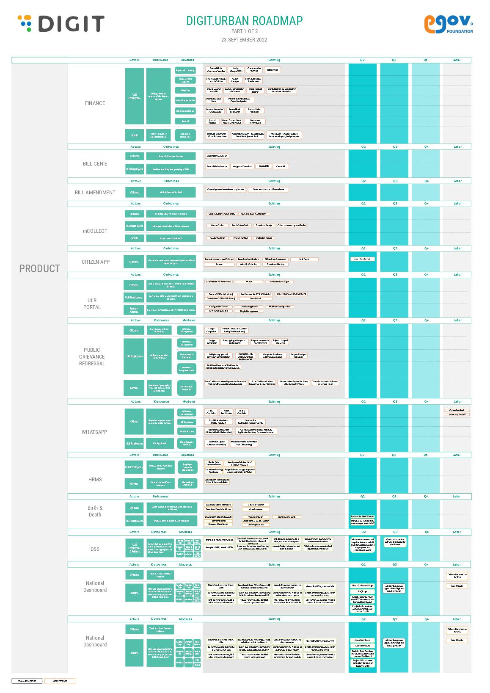
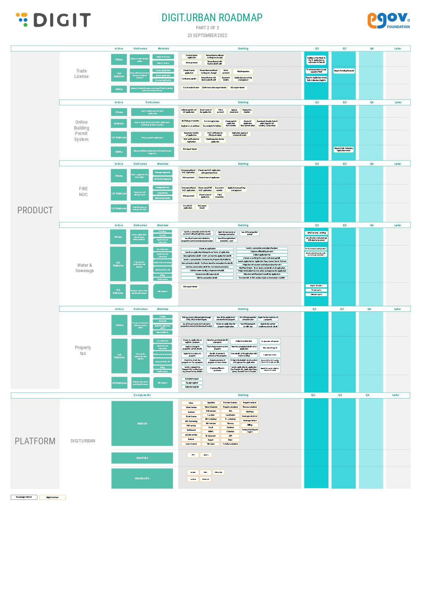

# Roadmap

## Yearly Roadmap&#x20;

Commitment and transparency are deeply ingrained values defining our product development approach. We are constantly developing new capabilities to facilitate the digital transformation of our cities. Take a glimpse into our DIGIT Urban Mission Roadmap to learn more about our upcoming tools and features.



Identify high-impact research and product innovation areas through validation, understanding the domain, and processes involved



Adopt improvements on the platforms that will address some key issues like privacy, security as well as adding new capabilities like GIS



Identify areas  and scope for improving mission outcomes and increasing adoption



Product feature enhancements and concentrated focus on increasing adoption

Create integrated user experience with a key focus on flexibility, accessibility, and quality of service; Optimized user experience



Explore our urban roadmap detailed view below.

<figure><figcaption></figcaption></figure>

<figure><figcaption></figcaption></figure>

> [\_\_](http://creativecommons.org/licenses/by/4.0/)_All content on this page by_ [_eGov Foundation_ ](https://egov.org.in/)_is licensed under a_ [_Creative Commons Attribution 4.0 International License_](http://creativecommons.org/licenses/by/4.0/)_._
