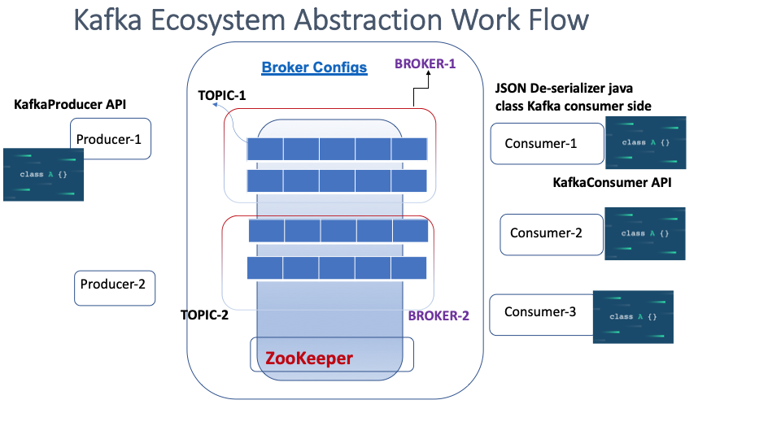
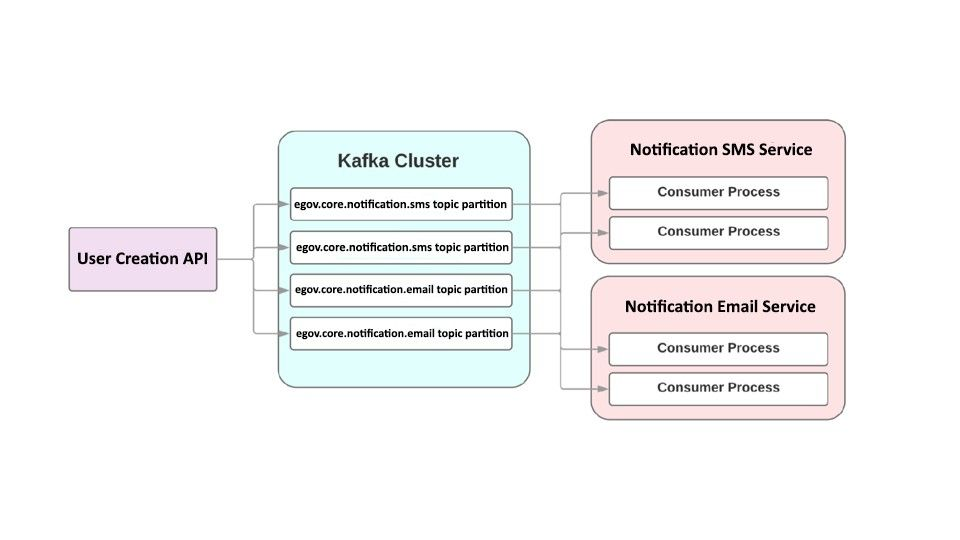

# Kafka Consumer Producer Approach

## **Workflow Introduction**

This document is to provide a high-level abstraction of Kafka workflow. Same documentation would be scaled to granular technical components as and when a grouping of services can be categorised from the ecosystem.

It’s important to note that we need to have closure engagements between development, solution engineering and QA automation teams to accommodate data streaming, staging and ecosystem workflows.

## **Kafka Abstraction Work Flow**

Kafka SMS Consumers

**egov.core.notification.sms** : egov-notification-sms listens to this topic to get the data.

Kafka Email Consumers

**egov.core.notification.email** : egov-notification-mail listens to this topic to listen for the updates on emails and then to send notifications to user.

Kafka Producers

Following are the Producer topic:

**egov.core.notification.sms.otp** :- This topic is used to send OTP to user mobile number.

**org.egov.core.notification.email** :- This topic is used to send OTP to user email id.

| SI No | **Core Services Name** | **API** | **Consumer** | **Producer** |
| :--- | :--- | :--- | :--- | :--- |
| 1 | egov-indexer | - | Yes | Yes |
| 2 | egov-notification-mail | - | Yes | - |
| 3 | egov-notification-sms |  | Yes | Yes |
| 4 | egov-persister | - | Yes | Yes |
| 5 | egov-pg-service | Yes |  | Yes |
| 6 | user-otp | Yes | - | Yes |
|  | **Business Services Name** | **API** | **Consumer** | **Producer** |
| 7 | billing-service | Yes | Yes | Yes |
| 8 | collection-services | Yes | Yes | Yes |
| 9 | dashboard-ingest | Yes | Yes | Yes |
| 10 | finance-collections-voucher-consumer | - | Yes | - |
| 11 | egov-apportion-service | Yes | - | Yes |
| 12 | egov-hrms | Yes | - | Yes |

### **Approach 1: User OTP**

The user-otp service send the OTP to user on login request, on password change request and during new user registration.

1. /userOtp API - Invoke \(**PRODUCER**\) this API using Karate \(user-otp\).
2. Connect to the Kafka Server running on QA using karate with respective TOPIC.
3. Define a Consumer class for the OTP producer Topic for reading producer data. Consumers will listen to the topic and verify for a given mobile number for which OTP has been generated or not.
4. Persist OTP produced data across the test flow of User OTP API.

### **Actions to Explore and Data Collection**

1. Full set of Producer and Consumer list required from End to End Eco-system
2. Filter grouping, Replication, High Availability, Broker Config Elements

### **Log Aggregation Solution**

1. Log Aggregation Solution: Collect logs from a number of eGov services and then make them available to consumers in a standard format.

> [\_\_](http://creativecommons.org/licenses/by/4.0/)_All content on this page by_ [_eGov Foundation_ ](https://egov.org.in/)_is licensed under a_ [_Creative Commons Attribution 4.0 International License_](http://creativecommons.org/licenses/by/4.0/)_._

