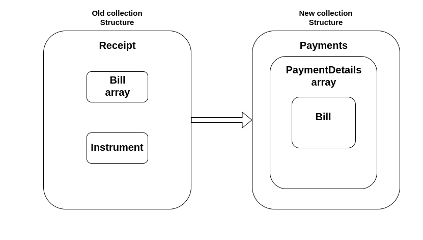

# Collection Service Migration

According to the new collection service, which follows the payment structure for storing the information about payments and payment details,  it is necessary to migrate the old collection structure into the payment structure.

In the old collection service, for every transaction, the receipt number is generated on the bill detail level, as the bill contains multiple bill details each transaction is mapped to multiple receipt number.  So after payment of a single bill, multiple receipt numbers are generated for it. The mapping of the transactions to the receipt number is changed in the new collection service.

In the new collection service, the receipt number is generated on bill level, so for every transaction for each bill, one receipt number is generated. So each bill for a consumer code and business service have one receipt number.

The records from tables **egcl\_receiptheader**, **egcl\_receiptdetails**, **egcl\_instrument**, **egcl\_instrumentheader**  need to be transferred into tables **egcl\_payment**, **egcl\_paymentdetail**, **egcl\_bill**, **egcl\_billdetial**, **egcl\_billaccountdetail.**

For smooth transaction of data, the record from the old receipt has been mapped according to payment structure, so that the new payment response can be formed with receipt data.

The table below provides the mapping between receipt and payment structure with some remarks.

<table>
  <thead>
    <tr>
      <th style="text-align:left"><b>Field from Payments</b>
      </th>
      <th style="text-align:left"><b>Field from Receipts</b>
      </th>
      <th style="text-align:left"><b>Remark</b>
      </th>
    </tr>
  </thead>
  <tbody>
    <tr>
      <td style="text-align:left">Payments.<b>Id</b> 
      </td>
      <td style="text-align:left">
        <ul>
          <li>---</li>
        </ul>
      </td>
      <td style="text-align:left">Set as UUID</td>
    </tr>
    <tr>
      <td style="text-align:left">Payments.<b>tenantId</b>
      </td>
      <td style="text-align:left">Receipt.<b>tenantId</b>
      </td>
      <td style="text-align:left"></td>
    </tr>
    <tr>
      <td style="text-align:left">Payments.<b>totalDue</b>
      </td>
      <td style="text-align:left">
        <ul>
          <li>---</li>
        </ul>
      </td>
      <td style="text-align:left">Total Due for payment is calculated by subtracting totalAmount from bill
        and amount from Receipt.instrument</td>
    </tr>
    <tr>
      <td style="text-align:left">Payments.<b>totalAmountPaid</b>
      </td>
      <td style="text-align:left">Receipt.instrument.<b>amount</b>
      </td>
      <td style="text-align:left"></td>
    </tr>
    <tr>
      <td style="text-align:left">Payments.<b>transactionNumber</b>
      </td>
      <td style="text-align:left">Receipt.instrument.<b>transactionNumber</b>
      </td>
      <td style="text-align:left"></td>
    </tr>
    <tr>
      <td style="text-align:left">Payments.<b>transactionDate</b>
      </td>
      <td style="text-align:left">Receipt.<b>receiptDate</b>
      </td>
      <td style="text-align:left"></td>
    </tr>
    <tr>
      <td style="text-align:left">Payments.<b>paymentMode</b>
      </td>
      <td style="text-align:left">Receipt.instrument.<b>instrumnetType</b>.<b>name</b>
      </td>
      <td style="text-align:left"></td>
    </tr>
    <tr>
      <td style="text-align:left">Payments.<b>instrumentDate</b>
      </td>
      <td style="text-align:left">Receipt.instrument.<b>instrumentDate</b>
      </td>
      <td style="text-align:left"></td>
    </tr>
    <tr>
      <td style="text-align:left">Payments.<b>instrumentNumber</b>
      </td>
      <td style="text-align:left">Receipt.instrument.<b>instrumentNumber</b>
      </td>
      <td style="text-align:left"></td>
    </tr>
    <tr>
      <td style="text-align:left">Payments.<b>instrumentStatus</b>
      </td>
      <td style="text-align:left">Receipt.instrument.<b>instrumentStatus</b>
      </td>
      <td style="text-align:left"></td>
    </tr>
    <tr>
      <td style="text-align:left">Payments.<b>ifscCode</b>
      </td>
      <td style="text-align:left">Receipt.instrument.<b>ifscCode</b>
      </td>
      <td style="text-align:left"></td>
    </tr>
    <tr>
      <td style="text-align:left">Payments.<b>additionalDetails</b>
      </td>
      <td style="text-align:left">Receipt.Bill.<b>additionalDetails</b>
      </td>
      <td style="text-align:left"></td>
    </tr>
    <tr>
      <td style="text-align:left">Payments.<b>paidBy</b>
      </td>
      <td style="text-align:left">Receipt.Bill.<b>paidBy</b>
      </td>
      <td style="text-align:left"></td>
    </tr>
    <tr>
      <td style="text-align:left">Payments.<b>mobileNumber</b>
      </td>
      <td style="text-align:left">Receipt.Bill.<b>mobileNumber</b>
      </td>
      <td style="text-align:left">
        
If mobileNumber from Receipt.bill is null it has to set with some value
          e.g: <b>&#x201C;NA&#x201D;</b>
        

        
Note: Payments.mobileNumber should not be null

      </td>
    </tr>
    <tr>
      <td style="text-align:left">Payments.<b>payerName</b>
      </td>
      <td style="text-align:left">Receipt.Bill.<b>payerName</b>
      </td>
      <td style="text-align:left"></td>
    </tr>
    <tr>
      <td style="text-align:left">Payments.<b>payerAddress</b>
      </td>
      <td style="text-align:left">Receipt.Bill.<b>payerAddress</b>
      </td>
      <td style="text-align:left"></td>
    </tr>
    <tr>
      <td style="text-align:left">Payments.<b>payerEmail</b>
      </td>
      <td style="text-align:left">Receipt.Bill.<b>payerEmail</b>
      </td>
      <td style="text-align:left"></td>
    </tr>
    <tr>
      <td style="text-align:left">Payments.<b>payerId</b>
      </td>
      <td style="text-align:left">Receipt.Bill.<b>payerId</b>
      </td>
      <td style="text-align:left"></td>
    </tr>
    <tr>
      <td style="text-align:left">Payments.<b>paymentStatus</b>
      </td>
      <td style="text-align:left">
        <ul>
          <li>--</li>
        </ul>
      </td>
      <td style="text-align:left">
        
Based on paymentMode from Payment, the paymentStatus is set.

        
If paymentMode is <b>ONLINE</b> or <b>CARD</b> then paymentStatus is set to <b>DEPOSITED</b> otherwise
          it is set to <b>NEW</b>
        

      </td>
    </tr>
    <tr>
      <td style="text-align:left">Payments.auditDetails.<b>createdBy</b>
      </td>
      <td style="text-align:left">Receipt.auditDetails.<b>createdBy</b>
      </td>
      <td style="text-align:left"></td>
    </tr>
    <tr>
      <td style="text-align:left">Payments.auditDetails.<b>createdTime</b>
      </td>
      <td style="text-align:left">Receipt.auditDetails.<b>createdTime</b>
      </td>
      <td style="text-align:left"></td>
    </tr>
    <tr>
      <td style="text-align:left">Payments.auditDetails.<b>lastModifiedBy</b>
      </td>
      <td style="text-align:left">Receipt.auditDetails.<b>lastModifiedBy</b>
      </td>
      <td style="text-align:left"></td>
    </tr>
    <tr>
      <td style="text-align:left">Payments.auditDetails.<b>lastModifiedTime</b>
      </td>
      <td style="text-align:left">Receipt.auditDetails.<b>lastModifiedTime</b>
      </td>
      <td style="text-align:left"></td>
    </tr>
    <tr>
      <td style="text-align:left">Payments.paymentDetails.<b>Id</b> 
      </td>
      <td style="text-align:left">
        <ul>
          <li>---</li>
        </ul>
      </td>
      <td style="text-align:left">Set as UUID</td>
    </tr>
    <tr>
      <td style="text-align:left">Payments.paymentDetails.<b>tenantId</b>
      </td>
      <td style="text-align:left">Receipt.<b>tenantId</b>
      </td>
      <td style="text-align:left"></td>
    </tr>
    <tr>
      <td style="text-align:left">Payments.paymentDetails.<b>totalDue</b>
      </td>
      <td style="text-align:left">
        <ul>
          <li>---</li>
        </ul>
      </td>
      <td style="text-align:left">Total Due for paymentDetails is calculated by subtracting totalAmount
        from bill and amount from Receipt.instrument</td>
    </tr>
    <tr>
      <td style="text-align:left">Payments.paymentDetails.<b>totalAmountPaid</b>
      </td>
      <td style="text-align:left">Receipt.instrument.<b>amount</b>
      </td>
      <td style="text-align:left"></td>
    </tr>
    <tr>
      <td style="text-align:left">Payments.paymentDetails.<b>receiptNumber</b>
      </td>
      <td style="text-align:left">Receipt.<b>receiptNumber</b>
      </td>
      <td style="text-align:left"></td>
    </tr>
    <tr>
      <td style="text-align:left">Payments.paymentDetails.<b>manualReceiptNumber</b>
      </td>
      <td style="text-align:left">Receipt.Bill.billDetails.<b>manualReceiptNumber</b>
      </td>
      <td style="text-align:left"></td>
    </tr>
    <tr>
      <td style="text-align:left">Payments.paymentDetails.<b>manualReceiptDate</b>
      </td>
      <td style="text-align:left">Receipt.Bill.billDetails.<b>manualReceiptDate</b>
      </td>
      <td style="text-align:left"></td>
    </tr>
    <tr>
      <td style="text-align:left">Payments.paymentDetails.<b>receiptDate</b>
      </td>
      <td style="text-align:left">Receipt.<b>receiptDate</b>
      </td>
      <td style="text-align:left"></td>
    </tr>
    <tr>
      <td style="text-align:left">Payments.paymentDetails.<b>receiptType</b>
      </td>
      <td style="text-align:left">Receipt.Bill.billDetails.<b>receiptType</b>
      </td>
      <td style="text-align:left"></td>
    </tr>
    <tr>
      <td style="text-align:left">Payments.paymentDetails.<b>businessService</b>
      </td>
      <td style="text-align:left">Receipt.Bill.billDetails.<b>businessService</b>
      </td>
      <td style="text-align:left"></td>
    </tr>
    <tr>
      <td style="text-align:left">Payments.paymentDetails.<b>additionalDetail</b>
      </td>
      <td style="text-align:left">Receipt.Bill.<b>additionalDetail</b>
      </td>
      <td style="text-align:left"></td>
    </tr>
    <tr>
      <td style="text-align:left">Payments.paymentDetails.<b>auditDetail</b>
      </td>
      <td style="text-align:left">
        <ul>
          <li>---</li>
        </ul>
      </td>
      <td style="text-align:left">auditDetail for paymentDetail is same as payment auditDetail</td>
    </tr>
    <tr>
      <td style="text-align:left">Payments.paymentDetails.<b>billId</b>
      </td>
      <td style="text-align:left">
        <ul>
          <li>---</li>
        </ul>
      </td>
      <td style="text-align:left">Based on id in <b>egbs_billdetail_v1</b> table billId is extracted,Where
        id in <b>egbs_billdetail_v1</b> is Receipt.Bill.billDetails.billNumber</td>
    </tr>
    <tr>
      <td style="text-align:left">Payments.paymentDetails.<b>bill</b>
      </td>
      <td style="text-align:left">
        <ul>
          <li>---</li>
        </ul>
      </td>
      <td style="text-align:left">Based on the billid, tenantid and service the bill is search by calling
        the Billing service API and set it to Payments.paymentDetails.bill</td>
    </tr>
    <tr>
      <td style="text-align:left">Payments.paymentDetails.bil.billDetails.<b>amountPaid</b>
      </td>
      <td style="text-align:left">Receipt.instrument.<b>amount</b>
      </td>
      <td style="text-align:left">For each amountPaid in billDetails, its value is set from Receipt.instrument.amount</td>
    </tr>
  </tbody>
</table>

After the creation of payment response with receipt data,  it has been pushed into kafka topic **“egov.collection.migration-batch”** and with the persister, payment data is inserted into tables **egcl\_payment**, **egcl\_paymentdetail**, **egcl\_bill**, **egcl\_billdetial**, **egcl\_billaccountdetail.**

Indexer config for the legacy data index and new payments.

[https://github.com/egovernments/configs/blob/master/egov-indexer/payment-indexer.yml](https://github.com/egovernments/configs/blob/master/egov-indexer/payment-indexer.yml)

**persister config -** 

[https://raw.githubusercontent.com/egovernments/configs/master/egov-persister/collection-migration-persister.yml?token=AGAOX7TAAE6QPRZBXU3QZV266URNW](https://raw.githubusercontent.com/egovernments/configs/master/egov-persister/collection-migration-persister.yml?token=AGAOX7TAAE6QPRZBXU3QZV266URNW)  

Please get these promoted before initiating the migration process. Migration happens through an API call, add role-actions based on your requirement. Otherwise, port-forwarding should work. 

Find the API details below:

Endpoint: /collection-services/payments/\_migrate?batchSize=100&offset=  
Body:  
{  
  "RequestInfo": {  
    "apiId": "Rainmaker",  
    "action": "",  
    "did": 1,  
    "key": "",  
    "msgId": "20170310130900\|en\_IN",  
    "ts": 0,  
    "ver": ".01",  
    "authToken": "a6ad2a1b-821c-4688-a70e-4322f6c34e54"  
}

While restarting migration due to any failure, take the value of _**offset**_ and _**tenantId**_ printed in the logs and resume the migration process where it ended.

**/collection-services/payments/\_migrate?batchSize=100&offset=200&tenantId='pb.tenantId'**

**Collection-service build:-** collection-services-db:9-COLLECTION\_MIGRATION-e9701c4

> [\_\_](http://creativecommons.org/licenses/by/4.0/)_All content on this page by_ [_eGov Foundation_ ](https://egov.org.in/)_is licensed under a_ [_Creative Commons Attribution 4.0 International License_](http://creativecommons.org/licenses/by/4.0/)_._

