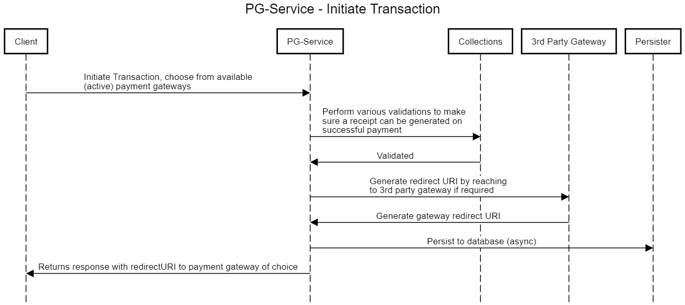
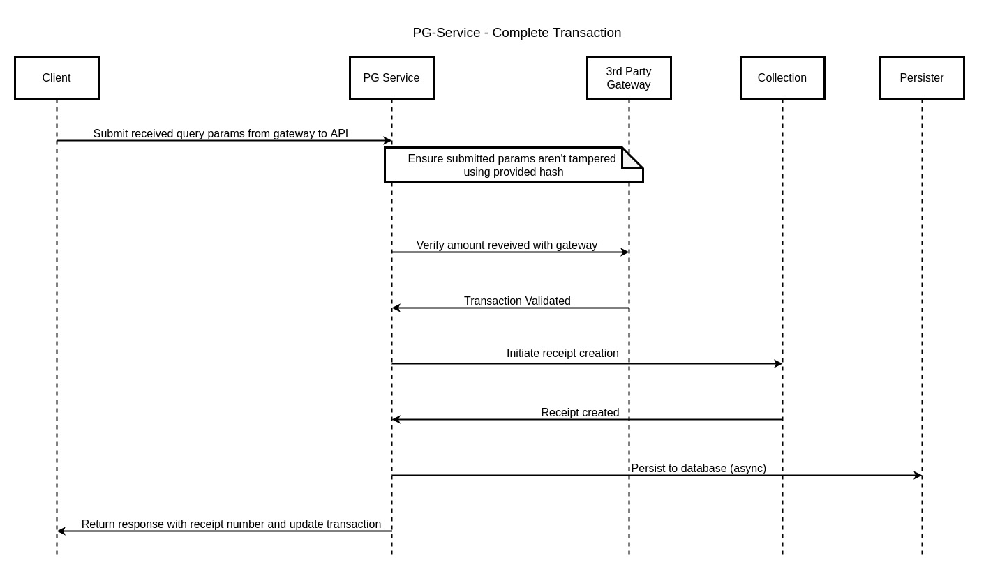

# Payment Gateway Service

eGov Payment Gateway acts as a liaison between eGov apps and external payment gateways facilitating payments, reconciliation of payments and lookup of transactions' status'.

### Pre-requisites 

Before you proceed with the documentation, make sure the following pre-requisites are met -

* _Java 8_
* Kafka server is up and running
* egov-persister service is running and has pg service persister config path added in it
* PSQL server is running and the database is created to store transaction data.

### Key Functionalities 

* Create or initiate a transaction, to make a payment against a bill.
* Make payment for multiple bill details \[multi module\] for a single consumer code at once.
* Transaction to be initiated with a call to the transaction/\_create API, various validations are carried out to ensure the sanctity of the request.
* The response includes a generated transaction id and a redirect URL to the payment gateway itself.
* Various validations are carried out to verify the authenticity of the request and the status is updated accordingly. If the transaction is successful, a receipt is generated for the same.

### Payment Flow 

#### Reconciliation 

* Reconciliation is carried out by two jobs scheduled via a Quartz clustered scheduler.
* Early Reconciliation job is set to run every 15 minutes \[configurable via app properties\], and is aimed at reconciling transactions which were created 15 - 30 minutes ago and are in PENDING state.
* Daily Reconciliation job is set to run once per day and is aimed at reconciling all transactions that are in PENDING state, except for ones which were created 30 minutes ago.

#### Extensions 

* Axis, Phonepe and Paytm payment gateways are implemented.
* Additional gateways can be added by implementing the [Gateway](https://raw.githubusercontent.com/egovernments/egov-services/master/core/egov-pg-service/src/main/java/org/egov/pg/service/Gateway.java) interface. No changes required to the core packages.

### Configuration Details

Following properties in the application.properties file in egov-pg-service has to be added and set to default value after integrating with the new payment gateway. In the below table properties for AXIS bank, payment gateway is shown the same relevant property needs to be added for other payment gateways.

| Property | Remarks |
| :--- | :--- |
| axis.active | Bollean lag to set the payment gateway active/inactive |
| axis.currency | Currency representation for merchant, default\(INR\) |
| axis.merchant.id | Payment merchant Id |
| axis.merchant.secret.key | Secret key for payment merchant |
| axis.merchant.user | User name to access the payment merchant for transaction |
| axis.merchant.pwd | Password of the user tp access payment merchant |
| axis.merchant.access.code | Access code |
| axis.merchant.vpc.command.pay | Pay command |
| axis.merchant.vpc.command.status | commans status |
| axis.url.debit | Url for making payment |
| axis.url.status | URL to get the status of the transaction |

### Deployment Details 

1. Deploy the latest version of egov-pg-service
2. Add pg service persister yaml path in persister configuration

### Integration Details 

#### Integration Scope 

The egov-pg-service acts as communication/contact between eGov apps and external payment gateways.

#### Integration Benefits 

* Record of every transaction against a bill.
* Record of payment for multiple bill details for a single consumer code at once.

#### Steps to Integration 

1. To integrate, host of egov-pg-service should be overwritten in helm chart
2. /pg-service/transaction/v1/\_create should be added in the module to initiates a new payment transaction, on successful validation
3. /pg-service/transaction/v1/\_update should be added as the update endpoint to updates an existing payment transaction. This endpoint is issued only by payment gateways to update the status of payments. It verifies the authenticity of the request with the payment gateway and forward all query params received from a payment gateway
4. _/pg-service/transaction/v1/\_search_ should be added as the search endpoint for retrieving the current status of a payment in our system.

### Reference Docs

#### Doc Links 

| **Title**  | **Link** |
| :--- | :--- |
| Swagger API Contract | [https://editor.swagger.io/?url=https://raw.githubusercontent.com/egovernments/egov-services/master/core/egov-pg-service/egov-pg-service.yml\#!/](https://editor.swagger.io/?url=https://raw.githubusercontent.com/egovernments/egov-services/master/core/egov-pg-service/egov-pg-service.yml#!/) |

#### API List 

| **Title** | **Link** |
| :--- | :--- |
| /pg-service/transaction/v1/\_create | [https://www.getpostman.com/collections/a0dfce4274235164c520](https://www.getpostman.com/collections/a0dfce4274235164c520) |
| /pg-service/transaction/v1/\_update | [https://www.getpostman.com/collections/a0dfce4274235164c520](https://www.getpostman.com/collections/a0dfce4274235164c520) |
| /pg-service/transaction/v1/\_search | [https://www.getpostman.com/collections/a0dfce4274235164c520](https://www.getpostman.com/collections/a0dfce4274235164c520) |
| /pg-service/gateway/v1/\_search | [https://www.getpostman.com/collections/a0dfce4274235164c520](https://www.getpostman.com/collections/a0dfce4274235164c520) |

\(Note: All the API’s are in the same postman collection, therefore, the same link is added in each row\)

 All content on this page by [eGov Foundation ](https://egov.org.in/)is licensed under a [Creative Commons Attribution 4.0 International License](http://creativecommons.org/licenses/by/4.0/).

