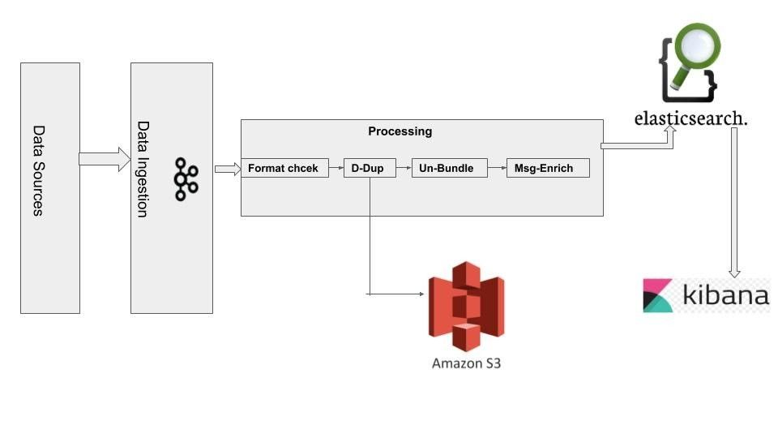

# Telemetry Service

Our telemetry service is built upon sunbird telemetry sdk. mSeva’s frontend React app pushes the telemetry JS file along with every response that it sends. Now, whenever a user interacts with any of the mSeva pages in any way, for e.g. entering values in a text box or when the window is loaded etc., the event gets triggered and is recorded.

Telemetry API collection can be found here - [https://www.getpostman.com/collections/65d183baffd3972cb925](https://www.getpostman.com/collections/65d183baffd3972cb925)

The telemetry payload consists of an events array. In DIGIT, only 3 event types are used namely START, SUMMARY and END event types. START signifies that events have now started getting collected for a particular page. SUMMARY signifies a collection of all the data that is required to get collected for that particular page for e.g. time spent by the user on that page, times at which the user came into the page, left the page for another tab etc. are all recorded as part of the SUMMARY event. END event signifies the end of collecting events. All these events keep getting collected and are bundled and sent when either the URL changes or the END event occurs.

Now, this event data is captured and pushed onto a Kafka topic and goes into the processing pipeline where we make a topic to topic transfer of the data. So, the format for events payload is checked, then it is pushed to another topic for de-duplicating. Similarly, the messages are unbundled and enriched via topic to topic transfer i.e. pick from one topic and push to another. In this case, there are two sinks, namely the Amazon S3 bucket and ES bucket. To perform this topic to topic transfer of data across the various components of the processing pipeline, Kafka streams (KStreams) are used which are nothing but a consumer and producer coupled together. To push data to S3 bucket, secor service is being used which is a service developed by Pinterest to pick up JSON data and to push it onto configured S3 buckets. Secor does not always create a new JSON file for any new data that it gets. There are two triggers for it, namely, reaching a particular threshold size or reaching a particular time threshold. To push data to the ES sink, Kafka connect is being used. Now, instead of making single API calls every time a message is received, the messages are again combined and persisted onto the ES index via bulk insert.

> [_​_](http://creativecommons.org/licenses/by/4.0/)_All content on this page by_ [_eGov Foundation_](https://egov.org.in/) _is licensed under a_ [_Creative Commons Attribution 4.0 International License_](http://creativecommons.org/licenses/by/4.0/)_._
