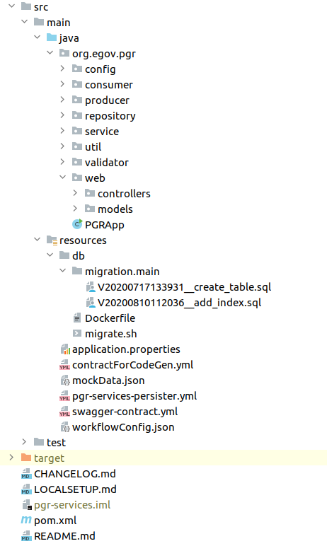

# Enhancing Existing Service

In DIGIT, most of the applications are RESTful services which follow the below project structure

_\(Note: The above structure image is for reference only\)_

## The structure consists of the following packages:- 

* **Config:** This package consists of configuration code and data for the application. The class defined here will read the value from the property file. While enhancing the service suppose new values are added in the property file those values are accessed through the config file defined in this package. 
* **Consumer:** This package consists of the Kafka Consumer program, which consumes the published messages from the producer. The consumer consumes the message by subscribing to the topic. A new consumer must be added to this package only. Refer to this document for[ writing a new consumer](https://digit-discuss.atlassian.net/l/c/ShuCAXy0). 
* **Producer:** This Package consists of the Kafka producer program, which pushes the data into the topic and the consumer consumes the message by subscribing to that same topic. 
* **Repository:** This package is a data access layer, which is responsible for retrieving data for the domain model. It only depends on the model layer. The classes define here could get data from the database or other Microservices by RESTful call. Any update in the data retrieval query has to be done in the classes present in the repository package. 
* **Service & Util:** This package is a service layer of the application. The implementation classes are defined here which consists of the business logic of the application or functionality of the APIs. Any modification in the functionality of API or business logic has to be done in the classes present in this package. **E.g:-** you have an API call which you need to modify then you create one more class or util function in a new file in service or util package and just call that function to do the work you want in the API code instead of writing code directly in the API file. 
* **Validation:** This package consists of a validation class for better processing of the application. While enhancing a service if a new validation method is required it has to be added to this package. 
* **Models:** The various models of the application are organised under the _models_ package. This package is a domain module layer, which has domain structs. Pojo's classes will be present here and these classes will be updated on the update of the contract of the service. And accordingly rowmapper class needs to update. 
* **Controller:** The most important part is the controller layer. It binds everything together right from the moment a request is intercepted until the response is prepared and sent back. The controller layer is present in the controller package, the best practices suggest that we keep this layer versioned to support multiple versions of the application. It expects to have different versions having different features. Refer to this document for [API Do's and Don'ts](https://digit-discuss.atlassian.net/l/c/DSc5y1LQ). 
* **DB.migration.main:** This package consists of flyway migration scripts related to setting up an application, for example, database scripts. For any changes in the database table of this service, a script has to be added to this package.

  * **Note:**   1\) Never overwrite the previously created scripts always create a new one as per  the requirements.  2\) The file name should follow this naming convention _\*\*V&lt;timestamp&gt;\_\_&lt;purpose&gt;.sql**\_**  ex: **\_**V20200717125510\_\_create\_table.sql\*\*\_ 

  Any changes here, if it is required to change the retrieval query then accordingly the classes present in the repository package have to update. And also the persister file associates with these services need to update.

* **application.properties:** The application.properties file is just straightforward key-value stockpiling for configuration properties. You can package the configuration file in your application jar or put the file in the file system of the runtime environment and load it on Spring Boot startup. This file contains the value of
  * server port
  * server context path
  * Kafka server configuration value
  * Kafka producer and the consumer configuration value
  * Kafka topic
  * External service path and many more.  Whatever changes are done in application.properties file the same changes need to be reflected in the [values.yaml](https://digit-discuss.atlassian.net/wiki/spaces/EPE/overview) file \(for reference only\) of a particular service. 
* After enhancing the service, the details about the new feature must be mentioned in [README.md](http://readme.md/), [LOCALSETUP.md](http://localsetup.md/) and [CHANGELOG.md](http://changelog.md/) file. And the version of service in the pom.xml file need to be increment. **Eg:** 1.0.0 to 1.0.1 or 1.0.0 to 1.1.0 depend upon the level of the enhancement.

[​](http://creativecommons.org/licenses/by/4.0/)All content on this page by [eGov Foundation](https://egov.org.in/) is licensed under a [Creative Commons Attribution 4.0 International License](http://creativecommons.org/licenses/by/4.0/).

