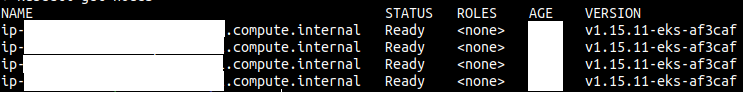

# Provision an EKS Cluster \(AWS\)

## Prerequisites

* [AWS account](https://portal.aws.amazon.com/billing/signup?nc2=h_ct&src=default&redirect_url=https%3A%2F%2Faws.amazon.com%2Fregistration-confirmation#/start) with the IAM permissions listed on the [EKS module documentation](https://github.com/terraform-aws-modules/terraform-aws-eks/blob/master/docs/iam-permissions.md)
* AWS CLI configured
* AWS IAM Authenticator
* [`kubectl`](https://learn.hashicorp.com/tutorials/terraform/eks#kubectl)

## Set up and initialize your Terraform workspace

Clone the following repository:

```bash
git clone https://github.com/egovernments/eGov-infraOps.git
cd eGov-infraOps/terraform
```

```
└── modules
    ├── db
    │   └── aws
    │       ├── main.tf
    │       ├── outputs.tf
    │       └── variables.tf
    ├── kubernetes
    │   └── aws
    │       ├── eks-cluster
    │       │   ├── main.tf
    │       │   ├── outputs.tf
    │       │   └── variables.tf
    │       ├── network
    │       │   ├── main.tf
    │       │   ├── outputs.tf
    │       │   └── variables.tf
    │       └── workers
    │           ├── main.tf
    │           ├── outputs.tf
    │           └── variables.tf
    └── storage
        └── aws
            ├── main.tf
            ├── outputs.tf
            └── variables.tf
```

In here, you will find three modules used to provision a EKS cluster, RDS, and Storage. 

#### Kubernetes module:

* **VPC Resources:**
  * VPC
  * Subnets
  * Internet Gateway
  * Route Table
* **EKS Cluster Resources:**
  * IAM Role to allow EKS service to manage other AWS services
  * EC2 Security Group to allow networking traffic with EKS cluster
  * EKS Cluster
* **EKS Worker Nodes Resources:**
  * IAM role allowing Kubernetes actions to access other AWS services
  * EC2 Security Group to allow networking traffic
  * Data source to fetch latest EKS worker AMI
  * AutoScaling Launch Configuration to configure worker instances
  * AutoScaling Group to launch worker instances

#### Database Module:

Configuration in this directory creates set of RDS resources including DB instance, DB subnet group and DB parameter group.

#### Storage Module:

Configuration in this directory creates EBS volume and attach it together.

## Set up an environment

Here, you will find five files used to provision a VPC, security groups, iam users, storages, EKS cluster, s3 bucket. The final product should be similar to this:

```text
├── dev
│   ├── main.tf
│   ├── outputs.tf
│   ├── providers.tf
│   ├── remote-state
│   │   └── main.tf
│   └── variables.tf
├── qa
    ├── main.tf
    ├── outputs.tf
    ├── providers.tf
    ├── remote-state
    │   └── main.tf
    └── variables.tf
```

Source for the each modules in the main.tf is from the modules like:

```text
../modules/storage/aws
../modules/kubernetes/aws/eks-cluster
```

Configuration in this directory creates set of:

* **s3 bucket:** to store terraform state.
* **Network:** VPC, security groups.
* **iam users auth:** using keybase to create admin, deployer, user.
  * Example user keybase user"_egovterraform_" needs to be created and has to uploaded his public key here - https://keybase.io/egovterraform/pgp\_keys.asc
* **EKS cluster:** with master\(s\) & worker node\(s\).
* **Storage\(s\):** for es-master, es-data-v1, es-master-infra, es-data-infra-v1, zookeeper, kafka, kafka-infra.

```text
cd eGov-infraOps/terraform/dev
terraform init
terraform apply
terraform output
```

The Kubernetes tools can be used to verify the newly created cluster. Once terraform apply execution is done it will generate the Kubernetes configuration file or you can get it from terraform state.

Set an environment variable so that kubectl picks up the correct config.

```text
export KUBECONFIG=./kube_config_file_name
```

Verify the health of the cluster.

```text
kubectl get nodes
```

You should see the details of your worker nodes, and they should all have a status Ready.



## Provision postgresql RDS

