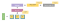

# Provision AKS Cluster \(Azure\)

[Azure Kubernetes Service \(AKS\)](https://docs.microsoft.com/en-us/azure/aks/) manages your hosted Kubernetes environment. AKS allows you to deploy and manage containerized applications without container orchestration expertise. AKS also enables you to do many common maintenance operations without taking your app offline. These operations include provisioning, upgrading, and scaling resources on demand.

### **Prerequisites** <a id="Prerequisites"></a>

* Azure subscription: If you don't have an Azure subscription, create a [free account](https://azure.microsoft.com/free/?ref=microsoft.com&utm_source=microsoft.com&utm_medium=docs&utm_campaign=visualstudio) before you begin.
* Configure Terraform: Follow the directions in the article, [Terraform and configure access to Azure](https://docs.microsoft.com/en-us/azure/developer/terraform/get-started-cloud-shell)
* Azure service principal: Follow the directions in the Create the service principal section in the article, [Create an Azure service principal with Azure CLI](https://docs.microsoft.com/en-us/cli/azure/create-an-azure-service-principal-azure-cli?view=azure-cli-latest). Take note of the values for the appId, displayName, password, and tenant.

### **Provision Kubernetes cluster stapes** <a id="Provision-Kubernetes-cluster-stapes"></a>

1.   Clone the following repository:

```text
git clone https://github.com/egovernments/eGov-infraOps.git  
cd eGov-infraOps/terraform
```

       Copy the existing azure tf.     

```text
├── bihar.dev
│       ├── main.tf
│       ├── outputs.tf
│       ├── providers.tf
│       ├── remote-state
│       │            └── main.tf
│       └── variables.tf
├── qa
│       ├── main.tf
│       ├── outputs.tf
│       ├── providers.tf
│       ├── remote-state
│       │            └── main.tf
│       └── variables.tf
└── modules
	          ├── db
            │       ├── aws
	          │       │ ├── main.tf
	          │       │ ├── outputs.tf
	          │       │ └── variables.tf
	          │       └── azure
	          │       │         ├── main.tf
	          │       │   	    └── variables.tf
	          │       ├── kubernetes
	          │                    └── azure
	          │                              │   	
	          │                              ├── main.tf
	          │              	               ├── outputs.tf
      	    │                              └── variables.tf
	          └── storage
    	                  └── azure
     	                  ├── main.tf
     	                  ├── outputs.tf
     	                  └── variables.tf       
```

                ``

*  s3 bucket: to store terraform state

 2. Change the [main.tf](http://main.tf/) according to your requirements,

```text
provider "azurerm" {

  # whilst the `version` attribute is optional, we recommend pinning to a given version of the Provider

  version = "=1.28.0"

  subscription_id  = ""

  tenant_id        = "”

  client_id = "${var.client_id}"

  client_secret = "${var.client_secret}"

}

resource "azurerm_resource_group" "resource_group" {

  name     = "${var.resource_group}"

  location = "${var.location}"

  tags = {

     environment = "${var.environment}"

  }

}

module "kubernetes" {

  source = "../modules/kubernetes/azure"

  environment = "${var.environment}"

  name = "Cluster_Name”

  location = "${azurerm_resource_group.resource_group.location}"

  resource_group = "${azurerm_resource_group.resource_group.name}"

  client_id = "${var.client_id}"

  client_secret = "${var.client_secret}"

  nodes = "Node_Count”

}

module "zookeeper" {

  source = "../modules/storage/azure"

  environment = "${var.environment}"

  itemCount = "Disk_Count”

  disk_prefix = "zookeeper"

  location = "${azurerm_resource_group.resource_group.location}"

  resource_group = "${module.kubernetes.node_resource_group}"

  storage_sku = "Premium_LRS"

  disk_size_gb = "Disk_Size”

  

}

module "kafka" {

  source = "../modules/storage/azure"

  environment = "${var.environment}"

  itemCount = "Disk_Count”

  disk_prefix = "kafka"

  location = "${azurerm_resource_group.resource_group.location}"

  resource_group = "${module.kubernetes.node_resource_group}"

  storage_sku = "Standard_LRS"

  disk_size_gb = "Disk_Siz"

  

}

module "es-master" {

  source = "../modules/storage/azure"

  environment = "${var.environment}"

  itemCount = "Disk_Count”

  disk_prefix = "es-master"

  location = "${azurerm_resource_group.resource_group.location}"

  resource_group = "${module.kubernetes.node_resource_group}"

  storage_sku = "Premium_LRS"

  disk_size_gb = "Disk_Siz"

  

}

module "es-data-v1" {

  source = "../modules/storage/azure"

  environment = "${var.environment}"

  itemCount = "Disk_Count”

  disk_prefix = "es-data-v1"

  location = "${azurerm_resource_group.resource_group.location}"

  resource_group = "${module.kubernetes.node_resource_group}"

  storage_sku = "Premium_LRS"

  disk_size_gb = "Disk_Size”

  

}

module "postgres-db" {

  source = "../modules/db/azure"

  server_name = "DB_Server_Name”

  resource_group = "${module.kubernetes.node_resource_group}"  

  sku_cores = "2"

  location = "${azurerm_resource_group.resource_group.location}"

  sku_tier = "Basic"

  storage_mb = "51200"

  backup_retention_days = "7"

  administrator_login = "DB_User_Name"

  administrator_login_password = "${var.db_password}"

  ssl_enforce = "Disabled"

  db_name = "DB_Name"

  environment= "${var.environment}"

 

}
```

 Declare the variables in [variables.tf](http://variables.tf/)\`\`

```text
variable "environment" {

    default = "Environment_Name"

}

variable "resource_group" {

    default = "Resource_Group_Name”

}

variable "location" {

    default = "SouthIndia"

}

variable "db_password" {

}

variable "client_id" {

}

variable "client_secret" {

}

```

Save the file and exit the editor 

Create a Terraform output file \([output.tf](http://output.tf/)\) and Paste the following code into file.

```text
output "zookeeper_storage_ids" {

  value = "${module.zookeeper.storage_ids}"

}

output "kafka_storage_ids" {

  value = "${module.kafka.storage_ids}"

}

output "es_master_storage_ids" {

  value = "${module.es-master.storage_ids}"

}

output "es_data_v1_storage_ids" {

  value = "${module.es-data-v1.storage_ids}"

}

```

3. Create the Kubernetes cluster

1. In this section, you see how to use the terraform init command to create the resources defined in the configuration files you created in the previous steps.

 The **terraform init** command displays the success of initializing the backend and  provider plug-in:


 2. Run the **terraform plan** command to create the Terraform plan that defines the infrastructure elements.

 The terraform plan command displays the resources that will be created when you run the terraform apply command


 3. Run the **terraform apply** command to apply the plan to create the Kubernetes

      cluster and other resources.

 The process to create a Kubernetes cluster can take several minutes. 

```text
terraform apply out.plan
```

   The terraform apply command displays the results of creating the resources  

   defined in your configuration files:



      4. In the Azure portal, select All resources in the left menu to see the resources created 

           for your new Kubernetes cluster.

4. Test the Kubernetes cluster

     The Kubernetes tools can be used to verify the newly created cluster.

1. Once **terraform apply** execution is done it will generate the Kubernetes configuration file or you can get it from Terraform state.

     2.  Set an environment variable so that kubectl picks up the correct config.

```text
export KUBECONFIG=./kube_config_file_name
```

     3. Verify the health of the cluster.

```text
kubectl get nodes
```

    You should see the details of your worker nodes, and they should all have a status 


