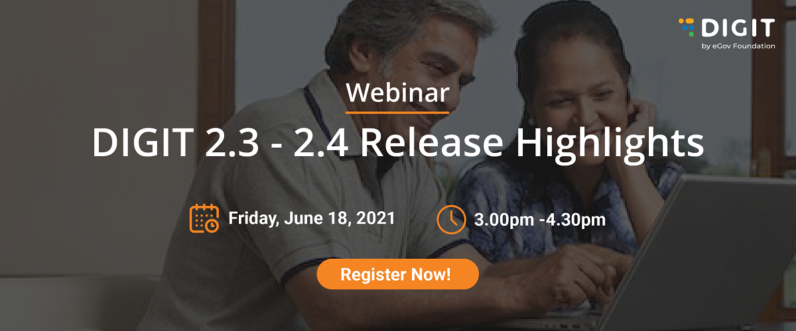

# Open Events

We have organized an interactive webinar session to walk you through the new developments on the DIGIT platform. The session will also address any queries you may have in context to the release features and platform upgrades.

[**Register NOW!**](https://us02web.zoom.us/webinar/register/WN_jFSs1OVZSKmV6JI4bZ37aA)\*\*\*\*

> **Business Heads, Program Managers, Business Analysts, Solution Architects, and DevOps Engineers** will find this session useful.


We are excited to have you join us for this event. In the meantime, we thought that our [docs ](https://egovernments.us15.list-manage.com/track/click?u=1c3d4853edcca0a9bf558e692&id=9e20321688&e=f5762a60cb)and resources around the release highlights might be helpful for you to learn more about the features. 

* [DIGIT 2.3 Release Notes](https://docs.digit.org/v/v2.3/digit-2.3-release-notes)
* [DIGIT 2.4 Release Notes](digit-release-notes/)
* New module: [Faecal Sludge Management ](https://docs.digit.org/v/v2.3/digit-2.3-release-notes/fsm-release-notes)
* New module: [eChallan ](digit-release-notes/echallan-release-notes.md)
* [Security Guidelines Handbook](digit-support/security-guidelines-handbook.md)
* [QA Automation Release Notes](digit-release-notes/qa-automation-release-notes.md)


**Click here to** [**Register** ](https://us02web.zoom.us/webinar/register/WN_jFSs1OVZSKmV6JI4bZ37aA)**for the event.**

