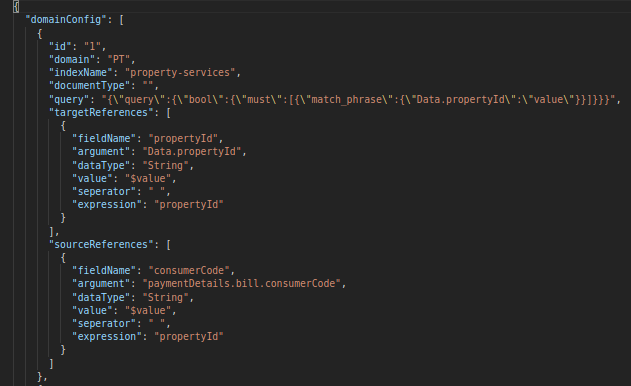
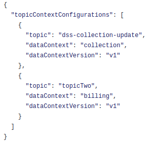
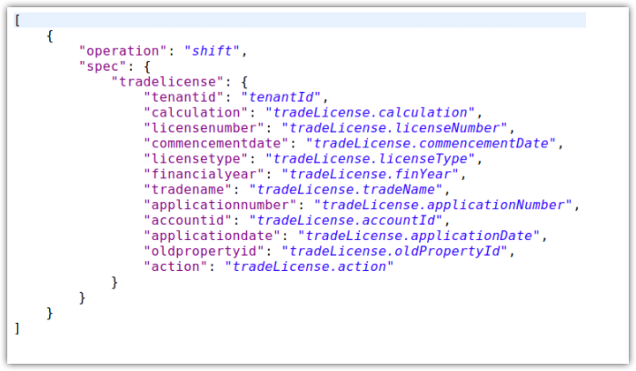

# DSS Configuration And Setup

## Overview <a href="#overview" id="overview"></a>

A decision support system (DSS) is a composite tool that collects, organizes, and analyzes business data to facilitate quality decision-making for management, operations, and planning. A well-designed DSS aids decision-makers in compiling a variety of data from many sources: raw data, documents, and personal knowledge from employees, management, executives, and business models. DSS analysis helps organizations identify and solve problems, and make decisions

This document explains the steps on how to define the configurations & set up the new dashboard in the DSS.

## Pre-requisites <a href="#pre-requisites" id="pre-requisites"></a>

Before you proceed with the configuration, make sure the following pre-requisites are met -

* Prior knowledge of Spring boot
* Prior knowledge of Kafka
* Prior knowledge of Elastic Search
* Prior knowledge of Kibana
* Prior knowledge of EQL (Elastic Query Language)
* Prior knowledge of JSON

## Key Functionalities <a href="#key-functionalities" id="key-functionalities"></a>

1. Creating a DSS dashboard schema
2. DSS ingest service APIs
3. Ingest service configurations
4. Creating a Kafka sync connector to push the data to elastic search

#### 1. Creating a DSS dashboard schema <a href="#1.-creating-a-dss-dashboard-schema" id="1.-creating-a-dss-dashboard-schema"></a>

When we are going to start indexing the DSS collection v2 index. We should create the schema in the ES using the Kibana query as there in the below file.

**2. DSS ingest service API**

Micro Service which runs as a pipeline and manages to validate, transform and enrich the incoming data and pushes the same to ElasticSearch Index. Ingest service will fetch the data from the index (paymentsindex-v1) which is specified in the indexing service API as below. The ingest service will read the configuration files which are there with v1. All the configuration files will be there [here](https://github.com/egovernments/punjab-rainmaker-customization/tree/UAT\_V2/configs/egov-dss-dashboards/dashboard-ingest).

```
curl -X POST \
http://dashboard-ingest.egov:8080/dashboard-ingest/ingest/migrate/paymentsindex-v1/v1 \
   -H 'Cache-Control: no-cache' \
   -H 'Content-Type: application/json' \
   -H 'Postman-Token: d380bebb-383f-1b7c-76d1-10c1dc07dd06' \
   -d '{
   "RequestInfo": {
     "apiId": "string",
     "ver": "string",
     "ts": null,
     "action": "string",
     "did": "string",
     "key": "string",
     "msgId": "string",
     "authToken": "b843ef27-1ac6-49b8-ab71-cd0c22f4e50e",
     "userInfo": {
       "id": 23299,
       "uuid":"e721639b-c095-40b3-86e2-acecb2cb6efb",
       "userName": "9337682030",
       "name": "Abhilash Seth",
       "type": "CITIZEN",
       "mobileNumber": "9337682030",
       "emailId": "abhilash.seth@gmail.com",
       "roles": [
         {
           "id": 281,
           "name": "Citizen"
         }
       ]
     }
   }
}'
```

**3. Ingest service configurations**

* Transform collection schema for V2
  * This transform collection v1 configuration file is used to map the incoming data. This mapped data will go inside the data object in the DSS collection v2 index.


[Click here for an example configuration](https://github.com/egovernments/punjab-rainmaker-customization/blob/UAT\_V2/configs/egov-dss-dashboards/dashboard-ingest/DomainConfig.json)

*   Here: **$i**, the variable value that gets incremented for the number of records of paymentDetails.

    **$j**, the variable value that gets incremented for the number of records of billDetails.
* Enrichment Domain Configuration
  * This configuration defines and directs the Enrichment Process that the data goes through.
  * For example, if the data which is incoming is belonging to a Collection Module data, then the Collection Domain config is picked. And based on the Business Type specified in the data, the right config is picked.
  * In order to enhance the data of Collection, the domain index specified in the configuration is queried with the right arguments and the response data is obtained, transformed and set.



[Click here for an example configuration](https://github.com/egovernments/punjab-rainmaker-customization/blob/UAT\_V2/configs/egov-dss-dashboards/dashboard-ingest/DomainConfig.json)

* Topic Context Configuration
  * Topic Context Configuration is an outline to define which data is received on which Kafka Topic.
  * Indexer Service and many other services are sending out data on different Kafka Topics. If the Ingest Service is asked to receive those data and pass it through the pipeline, the context and the version of the data being received have to be set. This configuration is used to identify as in which Kafka topic consumed the data and what is the mapping for that.



[Click here for an example configuration](https://github.com/egovernments/punjab-rainmaker-customization/blob/UAT\_V2/configs/egov-dss-dashboards/dashboard-ingest/TopicContextConfiguration.json)

* JOLT Domain Transformation Schema
  * JOLT is a JSON to JSON Transformation Library. In order to change the structure of the data and transform it in a generic way, JOLT has been used.
  * While the transformation schemas are written for each Data Context, the data is transformed against the schema to obtain transformed data.
  * [Follow the slide deck for JOLT Transformations](https://docs.google.com/presentation/d/1sAiuiFC4Lzz4-064sg1p8EQt2ev0o442MfEbvrpD1ls/edit#slide=id.p)



[Click here for an example configuration](https://github.com/egovernments/punjab-rainmaker-customization/blob/UAT\_V2/configs/egov-dss-dashboards/dashboard-ingest/transform\_tl\_v1.json)

* Validator Schema
  * Validator Schema is a configuration Schema Library from **Everit** Bypassing the data against this schema, it ensures that the data abides by the rules and requirements of the schema which has been defined.

.png>)

[Click here for an example configuration](https://github.com/egovernments/punjab-rainmaker-customization/blob/UAT\_V2/configs/egov-dss-dashboards/dashboard-ingest/validator\_transaction\_v1.json)

* Enhance Domain configuration
  * This configuration defines and directs the Enrichment Process that the data goes through.
  * For example, if the Data which is incoming is belonging to a Collection Module data, then the Collection Domain Config is picked. And based on the Business Type specified in the data, the right config is picked and the final data is placed inside the domain object.
  * In order to enhance the data of Collection, the domain index specified in the configuration is queried with the right arguments and the response data is obtained, transformed and set.


[Click here for an example configuration](https://github.com/egovernments/punjab-rainmaker-customization/blob/UAT\_V2/configs/egov-dss-dashboards/dashboard-ingest/EnhanceDomainConfig.json)


For the Kafka connect to work, Ingest pipeline application properties or in environments direct push must be disabled.

es.push.direct=false



If DSS collection index data is indexing directly ( without Kafka connector) to ES through the ingest pipeline then, make the application properties or in environments, direct push must be enabled.

es.push.direct=true


**4. Creating a Kafka sync connector to push the data to the Elasticsearch**

* Configure the Kafka topics in the environments or Ingest pipeline application properties as shown below.


* To start the indexing we will create a connecter that will take data from the topic and push it to the index we have mentioned in the "transforms.TopicNameRouter.replacement" and mention the ES host in the Kafka connection we have to mention the host URL in “connection.url”.
* To create the Kafka connector run the below curl command inside the playground pod:

```
curl -X POST \
 http://kafka-connect.kafka-cluster:8083/connectors/ \
 -H 'Cache-Control: no-cache' \
 -H 'Content-Type: application/json' \
 -H 'Postman-Token: 419e68ba-ffb9-4da9-86e1-7ad5a4c8d0b9' \
 -d '{
     "name": "dss-collection_v2-es-sink",
     "config": {
	 "connector.class":
"io.confluent.connect.elasticsearch.ElasticsearchSinkConnector",
	 "type.name": "general",
	 "tasks.max": "1",
	 "max.retries": "15",
	 "key.ignore": "false",
	 "retry.backoff.ms": "5000",
	 "max.buffered.records": "2000",
	 "value.converter": "org.apache.kafka.connect.json.JsonConverter",
	 "errors.log.enable": "true",
	 "key.converter":
"org.apache.kafka.connect.storage.StringConverter",
	 "read.timeout.ms": "10000",
	 "topics": "dss-collection-update",
	 "batch.size": "1000",
	 "max.in.flight.requests": "2",
	 "schema.ignore": "true",
	 "behavior.on.malformed.documents": "warn",
	 "flush.timeout.ms": "3600000",
	 "errors.deadletterqueue.topic.name": "dss-collection_v2-failed",
	 "errors.tolerance": "all",
	 "value.converter.schemas.enable": "false",
	 "name": "dss-collection_v2-es-sink",
	 "connection.url": "http://elasticsearch-client-v1.es-cluster:9200",
	 "linger.ms": "1000",
	 "transforms": "TopicNameRouter",
	 "transforms.TopicNameRouter.type":
"org.apache.kafka.connect.transforms.RegexRouter",
	 "transforms.TopicNameRouter.regex": "dss-collection_v2*",
	 "transforms.TopicNameRouter.replacement": "dss-collection_v2"
     }
}'
```

```
curl --location --request DELETE 'http://kafka-connect.kafka-cluster:8080/connectors/dss-collection_v2-es-sink'
```

## Reference Docs <a href="#reference-docs" id="reference-docs"></a>

#### Doc Links <a href="#doc-links" id="doc-links"></a>

| Description                               | Link                                                                                                                                                                                                                           |
| ----------------------------------------- | ------------------------------------------------------------------------------------------------------------------------------------------------------------------------------------------------------------------------------ |
| DSS Backend Configuration Manual          | [DSS Backend Configuration Manual](https://digit-discuss.atlassian.net/wiki/spaces/EPE/pages/117244081/DSS+Backend+Configuration+Manual)                                                                                       |
| DSS Dashboard - Technical Document for UI | [https://digit-discuss.atlassian.net/wiki/spaces/EPE/pages/283017217/DSS+Dashboard+-+Technical+Document+for+UI](https://digit-discuss.atlassian.net/wiki/spaces/EPE/pages/283017217/DSS+Dashboard+-+Technical+Document+for+UI) |
| DSS Technical Documentation               | [DSS Technical Documentation](https://digit-discuss.atlassian.net/wiki/spaces/EPE/pages/118521886/DSS+Technical+Documentation)                                                                                                 |

####

[​](http://creativecommons.org/licenses/by/4.0/)All content on this page by [eGov Foundation](https://egov.org.in/) is licensed under a [Creative Commons Attribution 4.0 International License](http://creativecommons.org/licenses/by/4.0/).
