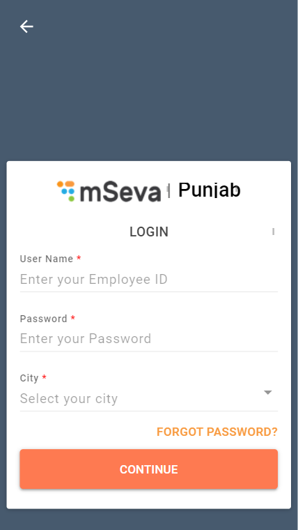
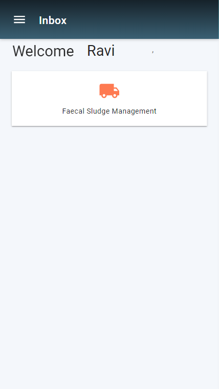
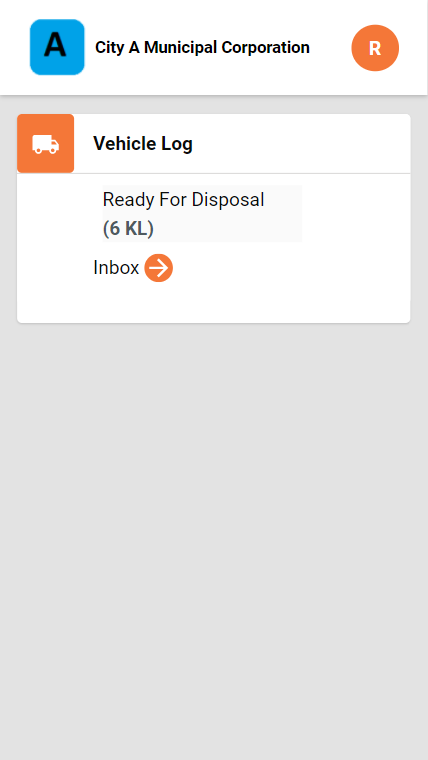
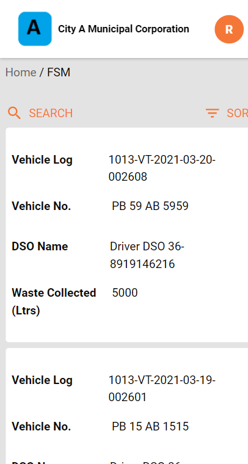
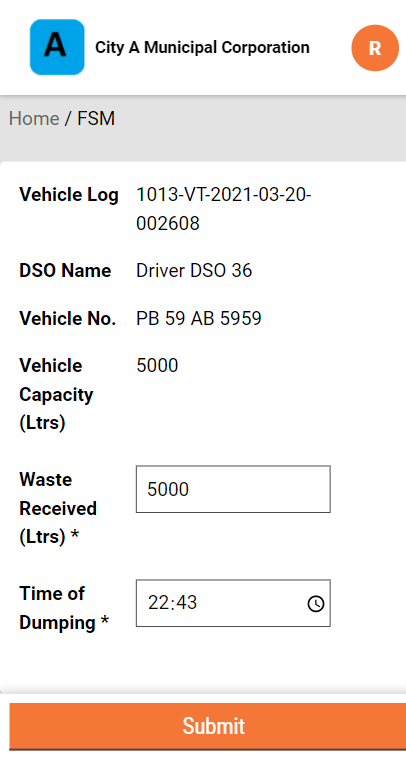
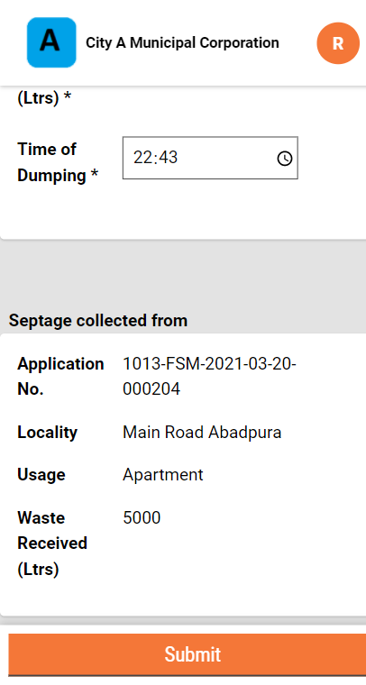

# Septage Treatment Plant Operator User Manual

The Septage Treatment Plant Operator \(SeTPO\) receives the list of planned desludging requests available in the system and updates the vehicle log entering the FSTP/STP every day.

SeTPO can

* Update desludging vehicle log

<<<<<<< HEAD
## Update Vehicle Log
=======
### Update Vehicle Log
>>>>>>> 64dca8adbdf64336b1a8203199b3791fa23434fa

Log in to the system with the SeTPO credentials.

Click on **Faecal Sludge Management** card on the page.

<<<<<<< HEAD
The user **Inbox** provides a summary log of vehicles and total waste collection capacity available for disposal. Click on the arrow icon to enter the Inbox.
=======
The user **Inbox** provides a summary log of vehicles and total waste collection capacity available for disposal. Click on the arrow icon to enter the Inbox. 
>>>>>>> 64dca8adbdf64336b1a8203199b3791fa23434fa

The inbox displays the **Vehicle Log** details. Click on the **Vehicle Log** to view the waste volume collected details at the plant.

<<<<<<< HEAD
Edit the **Waste Received \(Ltrs\)** value to indicate the volume of waste collected by the selected vehicle. The vehicle capacity value is auto-populated here by default. Edit the **Time of Dumping** of the waste as required.
=======
Edit the **Waste Received \(Ltrs\)** value to indicate the volume of waste collected by the selected vehicle. The vehicle capacity value is auto-populated here by default. Edit the **Time of Dumping** of the waste as required. 
>>>>>>> 64dca8adbdf64336b1a8203199b3791fa23434fa

The **Vehicle Log** screen displays the waste collection and the waste generator details. Scroll down to view the details.

<<<<<<< HEAD
Click on the **Submit** button to update the vehicle log details.

All content on this page by [eGov Foundation ](https://egov.org.in/)is licensed under a [Creative Commons Attribution 4.0 International License](http://creativecommons.org/licenses/by/4.0/).
=======
Click on the **Submit** button to update the vehicle log details. 

 All content on this page by [eGov Foundation ](https://egov.org.in/)is licensed under a [Creative Commons Attribution 4.0 International License](http://creativecommons.org/licenses/by/4.0/).
>>>>>>> 64dca8adbdf64336b1a8203199b3791fa23434fa

