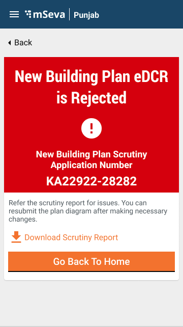
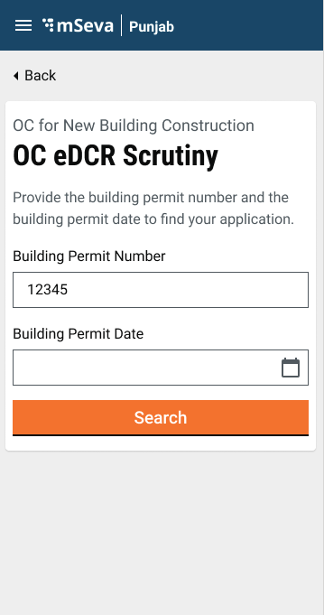

# OBPS EDCR /OC-EDCR

## **Objective** <a href="#objective" id="objective"></a>

To provide the facility for the stakeholder users to create and submit the eDCR Application. Stakeholders include Architect, Builder.....etc.

 (1).png>)

File Path:&#x20;

[https://github.com/egovernments/DIGIT-Dev/blob/develop/frontend/micro-ui/web/micro-ui-internals/packages/modules/obps/src/Module.js](https://github.com/egovernments/DIGIT-Dev/blob/develop/frontend/micro-ui/web/micro-ui-internals/packages/modules/obps/src/Module.js)

## **Apply for eDCR Application**

Users can apply for the eDCR application by clicking on the “Registered Architect Login”, through which only registered stakeholders (Stakeholder includes Architect, Builder.....etc) can log in. Other users will not be able to proceed further.

Stakeholders can generate the eDCR scrutiny number by clicking on Plan Scrutiny For New Construction link. They can add all the information, according to the questions asked, after filling the information in the eDCR form click on the Submit button. This triggers the Create API call. The success or failure of the API routes the user to the acknowledgement screen.\
\
**If eDCR API is Success** => it routes to the acknowledgement screen. Stakeholders can see the eDCR number, application number and download option.\
\
**If eDCR API is Failure** => it routes to the acknowledgement screen. Stakeholders can see the application number and download option but not eDCR number.

.png>)

File Path: [https://github.com/egovernments/DIGIT-Dev/blob/develop/frontend/micro-ui/web/micro-ui-internals/packages/modules/obps/src/pages/citizen/home.js](https://github.com/egovernments/DIGIT-Dev/blob/develop/frontend/micro-ui/web/micro-ui-internals/packages/modules/obps/src/pages/citizen/home.js)

### &#x20;**eDCR Scrutiny**

Users need to provide City, Applicant Name and Upload dxf file in order to generate the eDCR number.

.png>)

File Path: [https://github.com/egovernments/DIGIT-Dev/blob/develop/frontend/micro-ui/web/micro-ui-internals/packages/modules/obps/src/pageComponents/EDCRForm.js](https://github.com/egovernments/DIGIT-Dev/blob/develop/frontend/micro-ui/web/micro-ui-internals/packages/modules/obps/src/pageComponents/EDCRForm.js)

### **Success Screen**

Acknowledgement Page gets displayed after the success of eDCR create call. Here stakeholders can see -

1. eDCR Number
2. Application Number
3. Download option for downloading the scrutiny report
4. Apply for the building plan permit button for creating the BPA application( [OBPS BPA/OCBPA - ARCHITECT](https://digit-discuss.atlassian.net/wiki/spaces/DD/pages/1987379201) )
5. Go Back To Home button to navigate to the home page

.png>)

File Path: [https://github.com/egovernments/DIGIT-Dev/blob/develop/frontend/micro-ui/web/micro-ui-internals/packages/modules/obps/src/pages/citizen/EDCR/EDCRAcknowledgement.js](https://github.com/egovernments/DIGIT-Dev/blob/develop/frontend/micro-ui/web/micro-ui-internals/packages/modules/obps/src/pages/citizen/EDCR/EDCRAcknowledgement.js)

### **Failure Screen**

Failure acknowledgement page gets displayed if the eDCR Create API call results in failure due to some reason. Here stakeholders can see -

1. Application Number
2. Download option for downloading the scrutiny report
3. Go Back To Home button to navigate back to the home page



File Path: [https://github.com/egovernments/DIGIT-Dev/blob/develop/frontend/micro-ui/web/micro-ui-internals/packages/modules/obps/src/pages/citizen/EDCR/EDCRAcknowledgement.js](https://github.com/egovernments/DIGIT-Dev/blob/develop/frontend/micro-ui/web/micro-ui-internals/packages/modules/obps/src/pages/citizen/EDCR/EDCRAcknowledgement.js)

## **Applying for OC eDCR Application**

Users can apply for OC eDCR application by clicking on the Registered Architect Login link through which only registered stakeholders (Stakeholder includes Architect, Builder.....etc) can log in. Other users will not be able to proceed further.\
\
Stakeholders can generate the OC eDCR scrutiny number by clicking on the **OC Plan Scrutiny for new Construction** link. They can add all the information, according to the question asked, and after filling the information in the eDCR form steps clicking on the Submit button triggers the Create API call. Depending on the success or failure of the API call users are routed to the acknowledgement screen.

Permit Date and Permit Number of BPA is required to generate the OC eDCR. The permit details enables the search for specific BPA record followed by a search for the OLD eDCR details (BPA eDCR). These details are used to generate the OC eDCR Number.

&#x20;1\. **Data Required**

Click on **OC Plan Scrutiny for new Construction** link. This routes the user to the Data required screen and the screen provides information about the data required to generate OC eDCR number.

.png>)

Clicking on the Next button routes the user to the OC eDCR scrutiny details screen.

File Path: [https://github.com/egovernments/DIGIT-Dev/blob/develop/frontend/micro-ui/web/micro-ui-internals/packages/modules/obps/src/pageComponents/OCEDCRDocsRequired.js](https://github.com/egovernments/DIGIT-Dev/blob/develop/frontend/micro-ui/web/micro-ui-internals/packages/modules/obps/src/pageComponents/OCEDCRDocsRequired.js)

**2. OC eDCR Scrutiny Details**

After entering the permit number and permit date, stakeholders need to click the Search button. Internally BPA and eDCR search fetches the required data.



The BPA and eDCR search results display all details regarding the application along with the **proceed for OC scrutiny** button on a separate card.

.png>)

On clicking the Procced for OC scrutiny button users are redirected to the Upload OC Plan Diagram screen.

File Path:

[https://github.com/egovernments/DIGIT-Dev/blob/develop/frontend/micro-ui/web/micro-ui-internals/packages/modules/obps/src/pageComponents/OCeDCRScrutiny.js](https://github.com/egovernments/DIGIT-Dev/blob/develop/frontend/micro-ui/web/micro-ui-internals/packages/modules/obps/src/pageComponents/OCeDCRScrutiny.js)

**3. Upload OC Plan Diagram**

Users have to upload the dxf file and click on the Submit button that triggers the Create API call.&#x20;

.png>)

File Path:

[https://github.com/egovernments/DIGIT-Dev/blob/develop/frontend/micro-ui/web/micro-ui-internals/packages/modules/obps/src/pageComponents/OCUploadPlanDiagram.js](https://github.com/egovernments/DIGIT-Dev/blob/develop/frontend/micro-ui/web/micro-ui-internals/packages/modules/obps/src/pageComponents/OCUploadPlanDiagram.js)

### **Success Screen**

The Succss Acknowledgement Page gets displayed after a successful eDCR create call. Here stakeholders can see -

1. eDCR Number
2. Application Number
3. Download option, for downloading the scrutiny report
4. Apply for OC For New Construction button, for creating the BPA application( [OBPS BPA/OCBPA - ARCHITECT](https://digit-discuss.atlassian.net/wiki/spaces/DD/pages/1987379201) )
5. Go Back To Home button to navigate back to the home screen

Creating preview...

File Path:

[https://github.com/egovernments/DIGIT-Dev/blob/develop/frontend/micro-ui/web/micro-ui-internals/packages/modules/obps/src/pages/citizen/OCEDCR/EDCRAcknowledgement.js](https://github.com/egovernments/DIGIT-Dev/blob/develop/frontend/micro-ui/web/micro-ui-internals/packages/modules/obps/src/pages/citizen/OCEDCR/EDCRAcknowledgement.js)

### **Failure Screen**

The Failure Acknowledgement Page gets displayed in case the eDCR create call fails for some reason. Here stakeholders can see -

1. Application Number
2. Download option, for downloading the scrutiny report
3. Go Back To Home button to navigate back to the home screen

Creating preview...

File Path:&#x20;

[https://github.com/egovernments/DIGIT-Dev/blob/develop/frontend/micro-ui/web/micro-ui-internals/packages/modules/obps/src/pages/citizen/OCEDCR/EDCRAcknowledgement.js](https://github.com/egovernments/DIGIT-Dev/blob/develop/frontend/micro-ui/web/micro-ui-internals/packages/modules/obps/src/pages/citizen/OCEDCR/EDCRAcknowledgement.js)****

## **Technical Implementation Details**

All screens have been developed using the new-UI structure followed previously in FSM, PGR, PT and TL.

The link for the eDCR & OC eDCR Main Index is given below. It helps in understanding the starting point of the flow:

[https://github.com/egovernments/DIGIT-Dev/tree/develop/frontend/micro-ui/web/micro-ui-internals/packages/modules/obps/src/pages/citizen/EDCR - Connect to preview](https://github.com/egovernments/DIGIT-Dev/tree/develop/frontend/micro-ui/web/micro-ui-internals/packages/modules/obps/src/pages/citizen/EDCR)

[https://github.com/egovernments/DIGIT-Dev/tree/develop/frontend/micro-ui/web/micro-ui-internals/packages/modules/obps/src/pages/citizen/OCEDCR - Connect to preview](https://github.com/egovernments/DIGIT-Dev/tree/develop/frontend/micro-ui/web/micro-ui-internals/packages/modules/obps/src/pages/citizen/OCEDCR)\
\
eDCR and OC eDCR are part of OBPS ([OBPS DIGIT-UI](./) )

Config responsible for the routing of each flow

eDCR:&#x20;

[https://github.com/egovernments/DIGIT-Dev/blob/develop/frontend/micro-ui/web/micro-ui-internals/packages/modules/obps/src/config/edcrConfig.js](https://github.com/egovernments/DIGIT-Dev/blob/develop/frontend/micro-ui/web/micro-ui-internals/packages/modules/obps/src/config/edcrConfig.js)

OC eDCR:&#x20;

[https://github.com/egovernments/DIGIT-Dev/blob/develop/frontend/micro-ui/web/micro-ui-internals/packages/modules/obps/src/config/ocEdcrConfig.js](https://github.com/egovernments/DIGIT-Dev/blob/develop/frontend/micro-ui/web/micro-ui-internals/packages/modules/obps/src/config/ocEdcrConfig.js)&#x20;

## **MDMS Data**

Throughout the flow, a few of the page data is imported from MDMS. Following is the list of pages that are using MDMS data. These pages .js files can be found under page components.

| PageComponent | MDMS Detail | Module Details Name | Master Detail Name |
| ------------- | ----------- | ------------------- | ------------------ |
| EDCRForm      | City list   | `tenant`            | `citymodule`       |

For calling the MDMS data React Hooks has been used, so that it can be shared across modules. Below is the little code snippet for the call used for MDMS.

```
  const { data:homePageUrlLinks , isLoading: homePageUrlLinksLoading } = Digit.Hooks.obps.useMDMS(stateCode, "BPA", ["homePageUrlLinks"]);
```

## &#x20;**Localization**

Localization keys are added under the ‘_rainmaker-bpa_’ locale module. In future, if any new labels are implemented in the OBPS - Architect (Citizen) they should also be pushed to the locale DB under _rainmaker-bpa_ locale module. Below is an example of a few locale labels.

## &#x20;**API Call Role Action Mapping**

| [**S.No**](http://s.no)**.** | <p><strong>API</strong></p><p> </p> | **Action id** | **Roles**                                                                                                     |
| ---------------------------- | ----------------------------------- | ------------- | ------------------------------------------------------------------------------------------------------------- |
| 1                            | `/egov-mdms-service/v1/_search`     | `954`         | `CITIZEN`                                                                                                     |
| 2                            | `/edcr/rest/dcr/scrutinize`         | `2075`        | `BPA_ARCHITECT`, `BPA_TOWNPLANNER`, `BPA_BUILDER`, `BPA_STRUCTURALENGINEER`, `BPA_ENGINEER`, `BPA_SUPERVISOR` |
| 3                            | `/edcr/rest/dcr/scrutinydetails`    |               | `CITIZEN`                                                                                                     |
| 4                            | `/bpa-services/v1/bpa/_search`      |               | `CITIZEN`                                                                                                     |
| 5                            | `/filestore/v1/files/url`           | `1528`        | `CITIZEN`                                                                                                     |
| 6                            | `/localization/messages/v1/_search` | `1531`        | `CITIZEN`                                                                                                     |


> [_​_](http://creativecommons.org/licenses/by/4.0/)_All content on this page by_ [_eGov Foundation_](https://egov.org.in) _is licensed under a_ [_Creative Commons Attribution 4.0 International License_](http://creativecommons.org/licenses/by/4.0/)_._
