# FSM Citizen User Manual

Citizens represent individuals or communities who are the system end-users. The FSM module provides the citizens with the scope to apply for desludging services and make the payment for the applied services.

The citizens can -

* Apply for desludging services
* Check application status and vehicle status
* Download application acknowledgement
* Choose the pre-payment or post-payment (pay on service) option to apply for services
* Rate the services provided by the Urban Local Bodies (ULBs)

## Apply for Desludging Services

Enter **Mobile Number**, **Name**, and **City** details. Click on the **Continue** button.

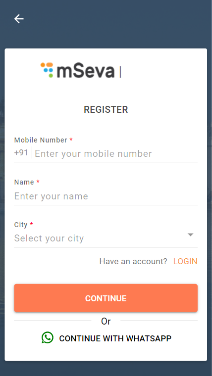 .png>)

Enter the **OTP** received on the given mobile number. Click on **Continue**. The system validates the details and allows the user to log in to the system with the registered mobile number.

.png>) 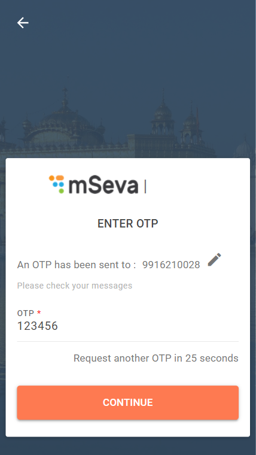

Enter your registered mobile number and the OTP received on the mobile to log in. Click on **Continue with Whatsapp** button to register your service request using the Whatsapp channel.

Click on the **Continue** button.

&#x20;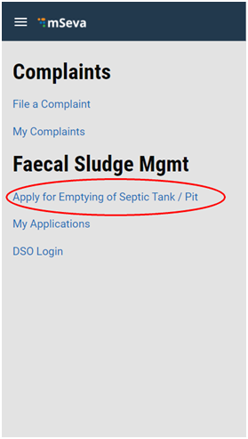

Click on **Apply for Emptying of Septic Tank/Pit** option on the home page.

.png>)

**Select Payment Preference** to indicate when to pay. The **Pay on Service** is the default option in case the user chooses to **Skip and Continue**.

&#x20;.jpg>)

Select the applicable **Gender**.

&#x20;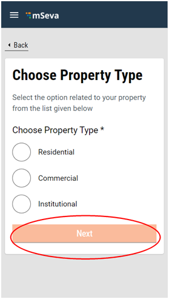

Select the relevant **Property Type**.

&#x20;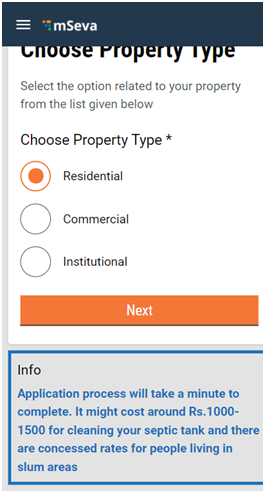

The system provides cost estimate details based on the selected property type. Click on the **Next** button.

&#x20;**** ****

Select the applicable **Property Sub Type.**

&#x20;**** ****

Enable the **Location** Finder to allow GPS to track the current location. Or, move the pin to the location manually. Alternatively, you can also enter the location in the Search bar. 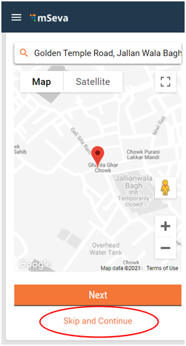

Click on **Skip and Continue** button in case you are unable to provide a GPS location. 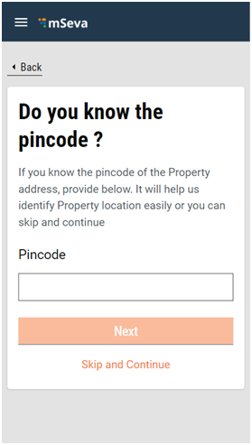

The **Pincode** field gets auto-populated if the location is selected on the map. Else, enter the **Pincode** of the location details manually. Click on **Skip and Continue** in case you are unable to provide the Pincode details.

&#x20;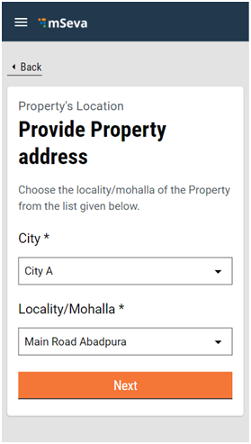

**City** and **Locality/Mohalla** fields are auto-populated once the **Pincode** is entered. Else, select the **City** and applicable **Locality/Mohalla** from the drop-down list. 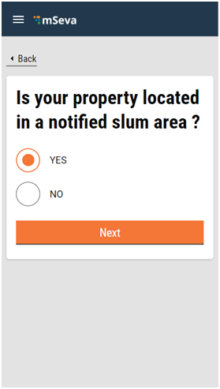

Select **Yes** if your property is located in a notified slum area. Else, select **No**. Click on the **Next** button to move to the next screen.

&#x20;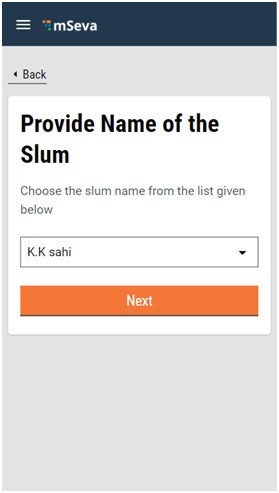

Select and enter the **Slum Name** from the available drop-down list. 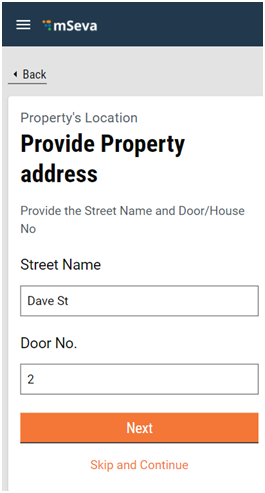

Enter the **Street Name** and **Door No.** details.

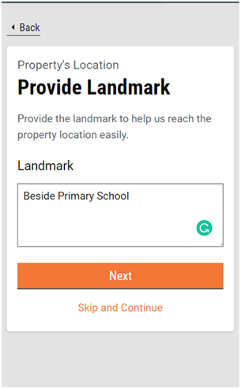

Provide a **Landmark** to enable the service providers to find the location easily.&#x20;

Select the applicable **Sanitation Type** from the listed options. Click on **Skip and Continue** button if you are not sure about the sanitation type.

&#x20;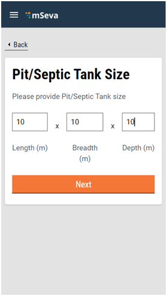

Enter the key dimensions like length, breadth, and depth in meters to indicate the **Pit/Septic Tank Size**. Enter the diameter and depth in meters in case the sanitation type is a soak pit.

Click on the **Next** button to move to the Summary page.

&#x20;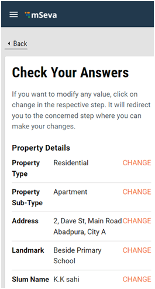

Cross verify the filled in details on the **Summary** page. Click on the **Change** button available for the field that requires any edits. Scroll down the page to review the application details. 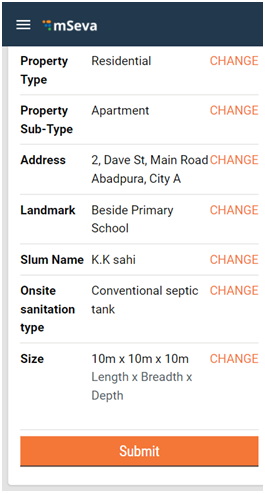

Click on the **Submit** button once the review is complete and the details are satisfactory. 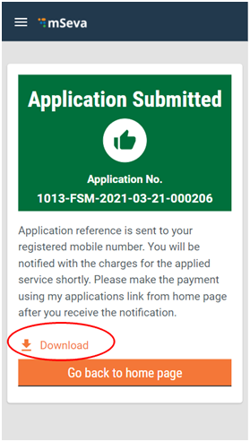

The system displays the **Application Submitted** message. The **Application No.** is generated.

Click on the **Download** button on the screen to generate a pdf copy of the application. 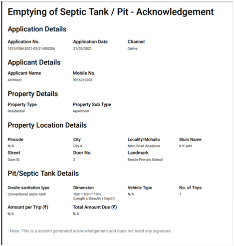

The system triggers a notification along with the **Application No.** and details to the registered mobile number. Any subsequent updates and actions on the application also trigger a notification to the applicant.

## Check Application Status & Make Payment

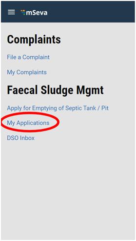

Click on **My Applications** on the citizen home page. Click on the **View** button for the application pending payment.

&#x20;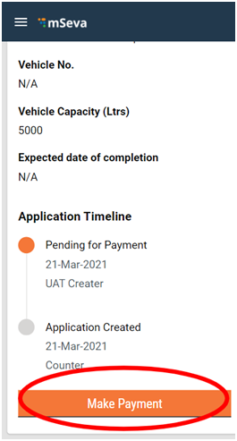

Scroll down the application and click on the **Make Payment** button. 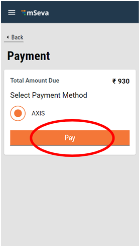

Select the applicable **Payment Method** and then click on the **Pay** button. 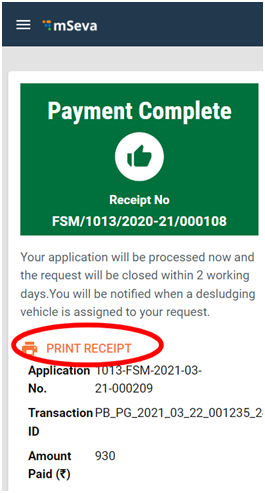

The system displays a payment acknowledgement message along with the **Payment Receipt No.** Click on the **Print Receipt** button to get a printed receipt.

&#x20;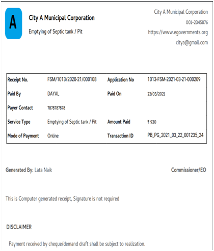

## Rate Services

Applicants can rate the services given and provide detailed feedback on their applications. 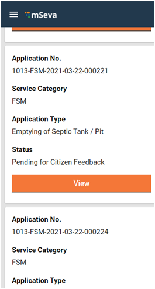

Go to **My Applications** and click on the **View** button for the application having the status **Pending for Citizen Feedback**.

&#x20;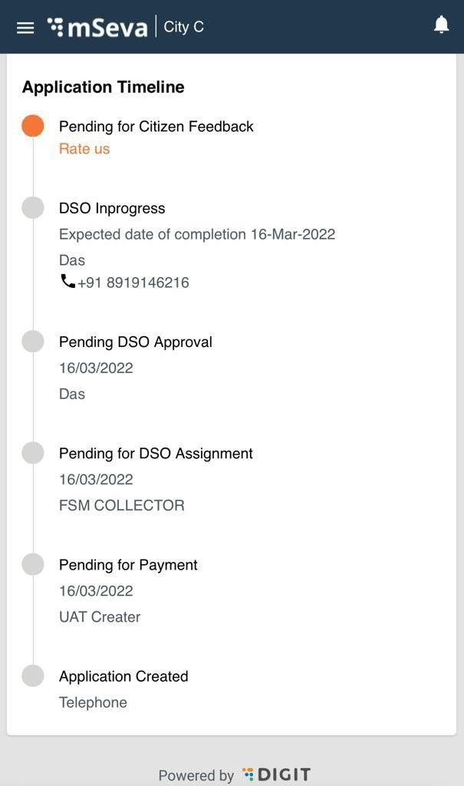

Scroll down the application to the **Application Timeline** section. Click on the **Rate Us** button. 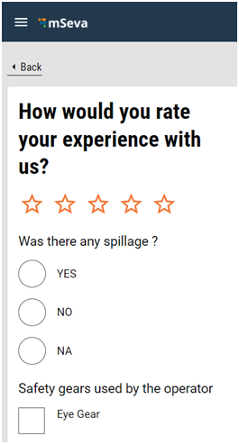

Enter your ratings by clicking on the number of stars. Answer the questions on the feedback form. 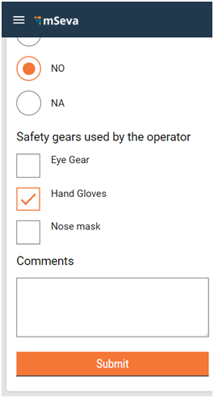

Enter any additional insights in the **Comments** box. Click on the **Submit** button. 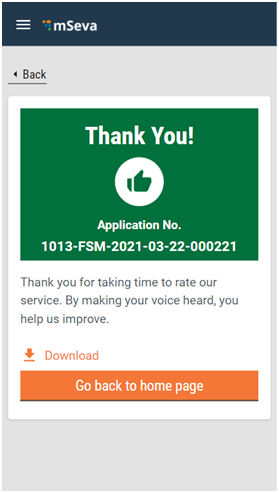

The feedback is submitted.

All content on this page by [eGov Foundation ](https://egov.org.in/)is licensed under a [Creative Commons Attribution 4.0 International License](http://creativecommons.org/licenses/by/4.0/).
