# DSO User Manual

The Desludging Operators or DSOs are responsible for initiating and completing action on the citizen requests for desludging services. The requests are routed to the respective DSOs by the ULB officials. The DSOs update the application status once the services are delivered and payments are collected.

DSOs can -

* [Assign vehicles for desludging services](dso-user-manual.md#assign-vehicles)
* [Decline service requests](dso-user-manual.md#decline-request)
* [Complete service requests](dso-user-manual.md#complete-request)

### Assign Vehicles

Click on **DSO Login**.

Enter the registered **Mobile Number**.

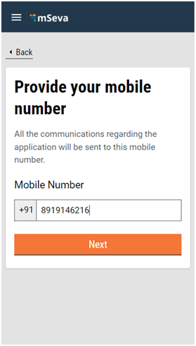

Enter the **OTP** received on the registered mobile number.

The DSO Inbox displays the list of applications pending action. Click on the arrow icon to view the applications.

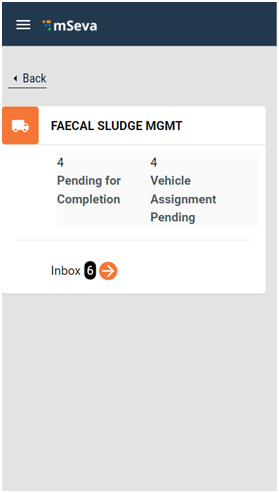

Applications with **Status as Pending DSO Approval** requires the DSO to initiate action. DSOs can either **Assign Vehicle** to complete the service request or **Decline Request** in case the service request cannot be fulfilled for some reason.

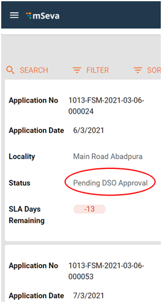

Scroll down the application page and click on **Take Action** button. Click on **Assign Vehicle**. The system auto-populates the vehicles registered with the logged-in DSO in the vehicle drop-down list.

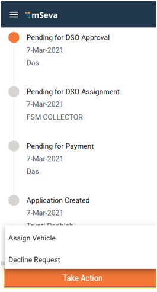

Select and enter **Vehicle Registration No.** The **Vehicle Capacity (Ltrs)** field is auto-populated depending on the selected vehicle. Click on **Assign Vehicle.** The vehicle is assigned successfully to the listed service request.

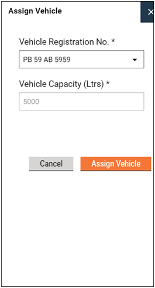

The application status changes to **DSO InProgress**.

&#x20;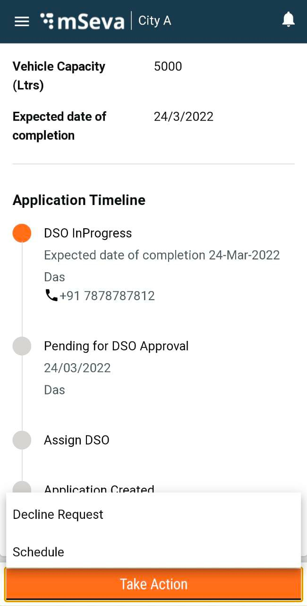

Click on the **Schedule** option to schedule the trips.

&#x20;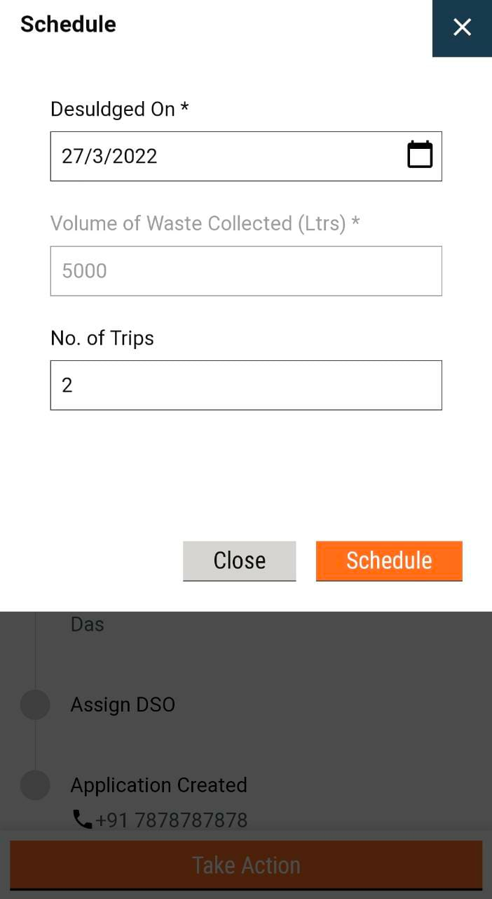

Confirm the number of trips and click on the **Schedule** button.&#x20;

Once the schedule is done, a notification is sent to citizens to make the payment and vehicle logs equal to the number of trips are created in the FSTPO inbox.&#x20;

Once all the trip entries are made in the FSTPO inbox, DSO can complete the request to service the next application.&#x20;

### Complete Request

Click on the **Take Action** button and click on **Complete Request**. 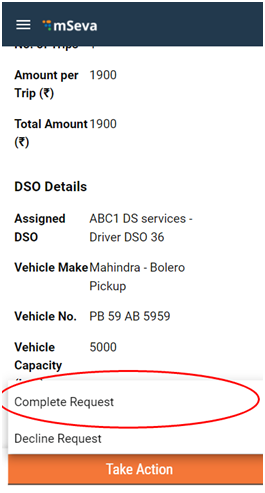

The **Septic Tank / Pit emptied On** field assumes the current date by default. Change the date if required.

&#x20;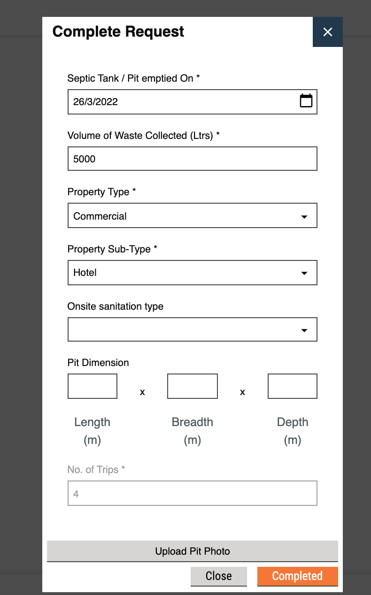

The **Volume of Waste Collected (Ltrs)** field displays the vehicle capacity value by default. Change if required. Validate the **Property Type**, **Property Sub Type**, **Onsite Sanitation Type**, and **Pit Dimension** details.

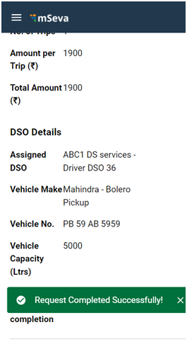

The request is completed successfully.

### Decline Request

Click on the **Take Action** button and then click on **Decline Request**. 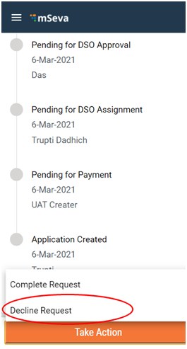

Select and enter the applicable **Reason for Declining.** Enter any **Comments** to validate the request decline. Click on the **Decline Request** button.

&#x20;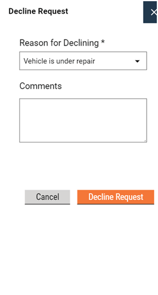

The service request is Declined Successfully.

&#x20;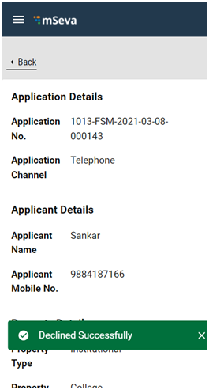

All content on this page by [eGov Foundation ](https://egov.org.in/)is licensed under a [Creative Commons Attribution 4.0 International License](http://creativecommons.org/licenses/by/4.0/).
